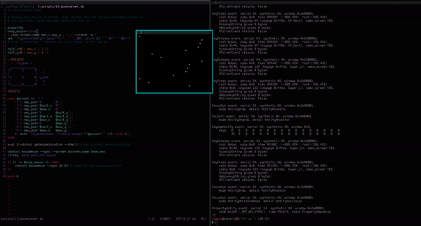

# i3_movecorner
Simple script to move i3 floating windows to screen corners.

Currently it does not support multi-display setups with different screen resolutions, but feel free to open a pull request.



## Usage

Call the script with a location preset:

`./i3_movecorner.sh 9` - will move the currently focused window to the bottom right

Presets available:

```
 _______________
|1      2      3|
|               |
|4      5      6|
|               |
|7______8______9|
```

## i3 config

You can bind this script to whatever keys you like in your i3 config. I use the keypad keys on mine.
```
bindsym $mod+KP_Home  exec --no-startup-id ~/scripts/i3_movecorner.sh 1
bindsym $mod+KP_Up    exec --no-startup-id ~/scripts/i3_movecorner.sh 2
bindsym $mod+KP_Prior exec --no-startup-id ~/scripts/i3_movecorner.sh 3
bindsym $mod+KP_Left  exec --no-startup-id ~/scripts/i3_movecorner.sh 4
bindsym $mod+KP_Begin exec --no-startup-id ~/scripts/i3_movecorner.sh 5
bindsym $mod+KP_Right exec --no-startup-id ~/scripts/i3_movecorner.sh 6
bindsym $mod+KP_End   exec --no-startup-id ~/scripts/i3_movecorner.sh 7
bindsym $mod+KP_Down  exec --no-startup-id ~/scripts/i3_movecorner.sh 8
bindsym $mod+KP_Next  exec --no-startup-id ~/scripts/i3_movecorner.sh 9
```
